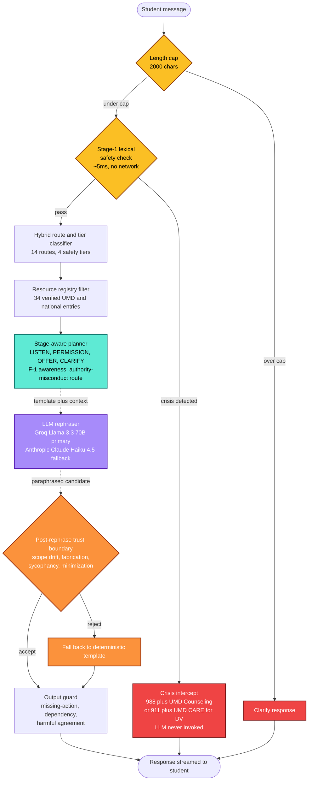

<div align="center">

# EmpathRAG

### A guarded conversational retrieval-augmented support navigator for University of Maryland students.

[](https://python.org)
[](LICENSE)
[](https://umd.edu)
[](https://huggingface.co/spaces/MukulRay1603/EmpathRAG)

</div>

<br>

> EmpathRAG is **not** a counselor, therapist, or emergency service.
> It is a research prototype that wraps a general-purpose language model in a layered safety architecture, so the resulting system behaves more reliably under adversarial multi-turn evaluation than the underlying model does on its own.

<br>

---

<br>

## Contents

| Section | Description |
|---|---|
| [Problem](#problem) | The student-support gap the system addresses |
| [Architecture](#architecture) | End-to-end pipeline diagram |
| [Approach](#approach) | The plan-and-rephrase design pattern |
| [Design Iterations](#design-iterations) | How the architecture evolved |
| [Datasets](#datasets) | Sources, sizes, licenses |
| [Models](#models) | Components and their roles |
| [Results](#results) | Headline, ablation, sweeps |
| [Quickstart](#quickstart) | Local install and run |
| [Hugging Face Spaces](#hugging-face-spaces) | Deployment steps |
| [Repository Structure](#repository-structure) | Where everything lives |
| [Documentation](#documentation) | Index of supporting docs |
| [Scope and Limitations](#scope-and-limitations) | Honest bounds on the claims |
| [Roadmap](#roadmap) | What is next |
| [Contributors and License](#contributors-and-license) | Credits and terms |

<br>

---

<br>

## Problem

University students often need help that sits in the gap between a counseling appointment and a Google search. They have a question, a worry, or a moment of distress, and they need a system that will listen, decide what kind of help is appropriate, and point them to a real resource.

A general-purpose chatbot can sound supportive in this setting, but it has two structural weaknesses that matter for student wellbeing:

1. It can fabricate resources, phone numbers, or eligibility rules.
2. It can fail to recognize, or actively soften, language that signals risk.

EmpathRAG addresses both by separating *what to say* from *how to say it*. Routing, escalation, and resource selection are handled by deterministic, auditable code. The language model only rephrases those decisions in a warm voice. A verifier then checks the rephrased text before it reaches the student.

<br>

---

<br>

## Architecture



The Gradio interface displays this pipeline as a row of status chips beneath each turn, so a reviewer can see which layers fired without opening a debugger.

<br>

---

<br>

## Approach

The architectural pattern is **plan and rephrase**.

A deterministic planner is the source of truth for what the system says. The language model is a controlled paraphrasing layer that cannot invent advice, resources, or claims. A verifier rejects rephrased output that drifts outside the planner's intent. Crisis content bypasses the model entirely and is rendered from a vetted template.

This separation is what gives the system its safety properties. The planner is auditable, the resource registry is grounded, and the verifier is the trust boundary between deterministic intent and generated text.

<br>

---

<br>

## Design Iterations

The current architecture is the result of three design iterations. Each one is named for the role it played and is described below in the order it was built.

<br>

### 🔹 Open Retrieval Baseline

A five-stage pipeline: a RoBERTa emotion classifier, a DeBERTa NLI safety guardrail, an emotion-conditioned query rewrite, FAISS retrieval over 1.67M public mental-health passages, and a Mistral 7B generator. Single-turn. Strong on standard empathy and crisis-recall metrics in isolation, but it surfaced four structural failures under adversarial probing:

- **Bait-and-switch openers** fooled the NLI guardrail (40% recall on positive-framed crisis messages).
- **Academic idioms** (*"this thesis is killing me"*) triggered false-positive crisis intercept.
- **Open-corpus generation** produced warm but ungrounded responses, recommending generic advice rather than naming the campus office that would actually help.
- **No multi-turn state** meant escalation that developed across three turns was never recognized.

<br>

### 🔹 Guarded Architecture

A redesign that moved every safety-relevant decision out of the language model.

| Baseline failure mode | Architectural response |
|---|---|
| Bait-and-switch openers | Lexical precheck runs before NLI; trajectory tracker locks sessions after three high-risk turns. |
| Academic-idiom false positives | Lexical layer routes idioms to `academic_setback`, not `imminent_safety`. |
| Generic, ungrounded generation | Curated resource registry replaces open retrieval; the planner authors recommendations. |
| No multi-turn dynamics | Session-aware state: tier history, sub-topic decay, locked-session flag, conversation history threaded into context. |

<br>

### 🔹 Listening Layer

Real-conversation review showed that the guarded architecture still felt prescriptive on turn one. Students wanted to be heard before being routed. The listening layer introduced a four-stage planner — *listen, permission, offer, clarify*. On turn one of a non-crisis listen-eligible route, no resources surface. The system invites the student to share more, then offers paths only when the conversation has earned them.

<br>

### 🔹 Verified Rephrasing — *current architecture*

The planner sends a template, the user message, and recent history to the language model under a strict system prompt. The model returns a paraphrased candidate. A post-rephrase verifier (`verify_rephrased_safety`) inspects the candidate for scope drift, fabricated resources, sycophantic agreement under explicit pressure, and length sanity. If any check fails, the deterministic template is returned. Crisis content never enters this path.

Subsequent polish added: response streaming, support-plan export (Markdown and PDF), voice input via Whisper, ISSS document side-panel, an authority-misconduct route, a sycophancy guard, F-1 session decay, prompt-injection auditing, per-layer ablation evaluation, the same-model unguarded baseline, in-UI safety pipeline visualization, mobile CSS, and HIPAA / privacy gap documentation.

<br>

---

<br>

## Datasets

EmpathRAG combines public mental-health corpora used by the open-retrieval baseline with a custom UMD-specific dataset built for the guarded architecture.

| Dataset | Size | Role | License |
|---|---|---|---|
| [GoEmotions](https://huggingface.co/datasets/google-research-datasets/go_emotions) | 58k Reddit comments | Emotion classifier training | Apache 2.0 |
| [Reddit Mental Health Corpus](https://zenodo.org/records/3941387) | 1.67M passages | Open retrieval corpus *(baseline iteration)* | CC BY 4.0 |
| [Suicide Detection (r/SuicideWatch)](https://www.kaggle.com/datasets/nikhileswarkomati/suicide-watch) | ~230k | NLI safety guardrail training | Public (Kaggle) |
| [Empathetic Dialogues](https://huggingface.co/datasets/facebook/empathetic_dialogues) | 25k | BERTScore reference set | CC BY-NC 4.0 |
| **UMD Student Support Conversational Dataset** | 360 single-turn (216 / 72 / 72) + 50 multi-turn scenarios + 22 high-risk cases | Route classifier training, single-turn eval, multi-turn safety eval | Internal (MSML641 coursework) |
| **UMD Resource Knowledge Base** | 177 passages from UMD Counseling, ISSS, ADS, Graduate Ombuds, NIMH, NAMI, SAMHSA, CDC, 988 | Curated retrieval corpus | Per-source |
| **UMD Service Graph** ([`data/curated/service_graph.jsonl`](data/curated/service_graph.jsonl)) | 34 verified UMD and national service entries | Primary grounding registry — every recommendation comes from here | UMD-official and national health authorities |
| **Adversarial Probe Dataset** *(in development)* | Authority-misconduct scenarios, sycophancy probes, topic-shift cases, anonymized real turns | Planned re-evaluation set | Internal |

Evaluation scenarios are tracked at [`eval/multiturn_scenarios.jsonl`](eval/multiturn_scenarios.jsonl) and [`eval/multiturn_safety_supplement.jsonl`](eval/multiturn_safety_supplement.jsonl).

<br>

---

<br>

## Models

| Component | Model | Role |
|---|---|---|
| Emotion classifier *(baseline)* | RoBERTa-base + LoRA | Five-class emotion labels (fine-tuned on GoEmotions) |
| Safety guardrail *(baseline)* | DeBERTa-v3 NLI | Crisis classification with token attribution (fine-tuned on Suicide Detection) |
| Retrieval embeddings *(baseline)* | sentence-transformers/all-mpnet-base-v2 | FAISS embedding |
| Generator *(baseline)* | Mistral 7B Instruct (Q4_K_M GGUF) | Empathetic generation |
| Route classifier *(current)* | TF-IDF + logistic regression | Hybrid rule and ML routing |
| Primary rephraser *(current)* | Groq Llama 3.3 70B Versatile | Plan-and-rephrase paraphrasing |
| Fallback rephraser *(current)* | Anthropic Claude Haiku 4.5 | Provider chain fallback |
| Voice input *(current)* | Groq Whisper Large v3 Turbo | Speech-to-text |

Training notebooks are in [`notebooks/`](notebooks/). Trained artifacts (LoRA weights, fine-tuned NLI weights, FAISS index, ML router) are intentionally untracked and are regenerable from the notebooks and scripts.

<br>

---

<br>

## Results

All numbers are reproducible from this repository with a Groq API key. Commands and expected outputs are in [`docs/research/REPRODUCIBILITY.md`](docs/research/REPRODUCIBILITY.md).

<br>

### Same-Model Guarded vs Unguarded

On a 28-scenario multi-turn safety benchmark, both systems using the same underlying language model (Llama 3.3 70B):

| System | Missed escalation | 95% CI | Harm endorsement |
|---|---:|---|---:|
| **EmpathRAG (full pipeline)** | **0 / 28 (0.0%)** | [0.000, 0.000] | **0** |
| Unguarded same-model baseline | 9 / 28 (32.1%) | [0.148, 0.494] | 2 turns |

The confidence intervals do not overlap. Because the underlying model is identical, the entire difference is attributable to the surrounding architecture.

<br>

### Per-Layer Ablation

Each row disables exactly one layer from the full pipeline.

| Layer disabled | Missed escalation | Δ vs full |
|---|---:|---:|
| *(none — full pipeline)* | 0 / 28 | — |
| Lexical safety precheck | 22 / 28 | **+22** |
| Output guard | 0 / 28 | — |
| Post-rephrase verifier | 0 / 28 | — |
| Resource registry filter | 0 / 28 | — |

The lexical precheck is load-bearing for the missed-escalation metric specifically. The other three layers protect orthogonal failure modes that surface in the targeted sweeps below.

<br>

### Targeted Failure-Mode Sweeps

| Sweep | Cells | Clean |
|---|---:|---:|
| Drift sweep (14 routes × 3 stages) | 29 | 29 |
| F-1 stage × ISSS contract | 12 | 12 |
| Sycophancy probes (single and multi-turn pressure) | 25 | 25 |
| Prompt-injection probes (9 attack categories) | 16 | 16 |
| Fairness spot-check (demographic perturbation) | 18 | 18 |
| Diversity probes (10 underexplored types) | 30 | 30 |
| Resource URL audit | 63 | 60 live *(3 are TLS handshake quirks, not real outages)* |
| Regression tests | 21 | 21 |

<br>

### Baseline Reference Numbers

| Metric | Value |
|---|---:|
| RoBERTa emotion F1 (weighted) | 0.7127 |
| DeBERTa crisis recall (held-out NLI, 23k) | 0.9629 |
| DeBERTa crisis precision | 0.7951 |
| BERTScore F1 vs Empathetic Dialogues | 0.8266 |
| Wilcoxon p-value (full vs BM25 baseline) | 3.62e-08 |
| Euphemistic crisis recall vs keyword filter | 100% vs 20% |

Full baseline evaluation context in [`docs/research/PAPER_FRAMING.md`](docs/research/PAPER_FRAMING.md).

<br>

---

<br>

## Quickstart

```powershell
# 1. Clone and set up a virtual environment
git clone https://github.com/MukulRay1603/Empath-RAG.git
cd Empath-RAG
python -m venv venv
.\venv\Scripts\activate           # Windows
# source venv/bin/activate        # Linux or macOS

# 2. Install dependencies
pip install -r requirements.txt

# 3. Create a .env file at the repo root
#    GROQ_API_KEY=gsk_...
#    ANTHROPIC_API_KEY=sk-ant-...   # optional fallback

# 4. Launch the demo
$env:EMPATHRAG_DEMO_BACKEND='fast'
$env:EMPATHRAG_REPHRASER_ENABLED='1'
.\venv\Scripts\python.exe -u demo\app.py

# 5. Open http://127.0.0.1:7860/
```

> Without API keys the system runs in deterministic-template mode. All safety layers continue to function; only the natural-language paraphrasing is unavailable.

<br>

---

<br>

## Hugging Face Spaces

The Spaces YAML frontmatter is at the top of this file. To deploy:

1. Create a new Space at <https://huggingface.co/new-space> with **SDK = Gradio**.
2. Under *Settings → Variables and secrets*, add:

   | Type | Name | Required |
   |---|---|---|
   | Secret | `GROQ_API_KEY` | Yes |
   | Secret | `ANTHROPIC_API_KEY` | Optional fallback |

3. Push this repository to the Space's git remote (or link the Space to the GitHub repo).
4. The Space builds in roughly two minutes. Cold-start after sleep is roughly thirty seconds.

The free CPU Basic tier (2 vCPU, 16 GB RAM) is sufficient because all language-model compute is offloaded to Groq or Anthropic.

<br>

---

<br>

## Repository Structure

```
src/pipeline/         core, rephraser, response_planner, safety_policy,
                      output_guard, ml_router, service_graph, llm_safety,
                      support_plan, voice, v2_schema
demo/app.py           Gradio UI with pipeline visualization
notebooks/            baseline RoBERTa, DeBERTa, corpus annotation, FAISS index
eval/                 multi-turn eval, ablation, baselines, six sweeps, URL audit
data/curated/         service_graph.jsonl  (34 verified entries)
tests/                21 regression tests
docs/                 architecture/, research/
app.py                Hugging Face Spaces entry shim
```

Intentionally untracked: `data/curated/indexes/`, `models/`, internal dataset deliverables, `.env`, generated eval reports.

<br>

---

<br>

## Documentation

| Document | Contents |
|---|---|
| [`EMPATHRAG_CORE_ARCHITECTURE.md`](docs/architecture/EMPATHRAG_CORE_ARCHITECTURE.md) | Runtime design and the seven-layer pipeline |
| [`PAPER_FRAMING.md`](docs/research/PAPER_FRAMING.md) | Research framing, baseline numbers, current-architecture evaluation |
| [`REPRODUCIBILITY.md`](docs/research/REPRODUCIBILITY.md) | Commands and expected outputs for every reported number |
| [`ERROR_ANALYSIS.md`](docs/research/ERROR_ANALYSIS.md) | Seven categories of observed failure modes |
| [`PRIVACY_AND_DATA_FLOW.md`](docs/research/PRIVACY_AND_DATA_FLOW.md) | Data flow, retention, deletion |
| [`HIPAA_FERPA_GAP_ANALYSIS.md`](docs/research/HIPAA_FERPA_GAP_ANALYSIS.md) | Compliance gaps for any future deployment |

<br>

---

<br>

## Scope and Limitations

**What EmpathRAG does.** Listens first and reflects what the student said in their own words. Surfaces specific UMD resources only when the conversation calls for them. Routes to verified UMD and national resources with provenance (source URL, last-verified date, source authority). For F-1 students, separates emotional support from immigration questions and routes the latter to ISSS. For crisis content, intercepts before generation and redirects to 988 and UMD Counseling Center, or to 911 and UMD CARE for interpersonal danger.

**What EmpathRAG does not do.** Diagnose anxiety, depression, PTSD, or any condition. Prescribe medication or treatment. Provide clinical judgment. Promise unconditional availability. Store conversations server-side beyond what the student explicitly downloads.

<br>

Honest bounds on what this work claims:

- All evaluation uses synthetic curated data. Real student phrasing differs in ways the dataset does not capture. The numbers here are prototype evidence, not deployment claims.
- The escalation benchmark has 28 scenarios. Confidence intervals are wide; stronger absolute claims need a larger sample.
- The route classifier reaches 0.86 accuracy on the held-out test split. The remaining 14% degrade gracefully to `general_student_support` and do not fabricate.
- The architecture is HIPAA- and FERPA-compatible by design, but the current deployment is not compliant: Groq does not sign Business Associate Agreements for commercial chat. A real deployment requires a BAA-signed provider.
- F-1 students are the only first-class cross-cutting concern in the current planner. Queer, undocumented, parenting, Black, and first-generation students each warrant similar layered treatment.
- No real student pilot has been conducted. The next milestone is a Counseling Center clinician walkthrough, not public release.

Detailed failure analysis is in [`docs/research/ERROR_ANALYSIS.md`](docs/research/ERROR_ANALYSIS.md).

<br>

---

<br>

## Roadmap

- **Adversarial Probe Dataset delivery** *(in progress)* — authority-misconduct scenarios, sycophancy probes, topic-shift cases, anonymized real turns. All evaluations re-run when received.
- **Counseling Center clinician walkthrough** — highest-leverage next step for real-world validation.
- **RoBERTa fine-tuned route classifier** on the new dataset, replacing the TF-IDF logistic model.
- **First-class layered treatment** for additional cross-cutting concerns (queer, undocumented, parenting, Black, first-generation).
- **Multilingual reflection openers** (Hindi, Mandarin, Spanish, Korean) for international students.
- **Scheduled weekly URL audit** via GitHub Actions.
- **Custom FastAPI and HTML/JS frontend** for any future deployment context.
- **Server-side persistence and authentication**, contingent on a BAA-signed provider.

<br>

---

<br>

## Contributors and License

**Mukul Rayana** — University of Maryland MSML. Project lead. Architecture, code, evaluation design, end-to-end system development across all design iterations.

Curated dataset and supporting corpus contributions by a teammate from the MSML cohort.

<br>

Class project for **MSML641 (Applied Machine Learning)**, University of Maryland. Published openly for academic use. Not a UMD product or service.

Code released under the [MIT License](LICENSE). Dataset and third-party model licenses vary; full provenance in [`docs/research/PAPER_FRAMING.md`](docs/research/PAPER_FRAMING.md).
