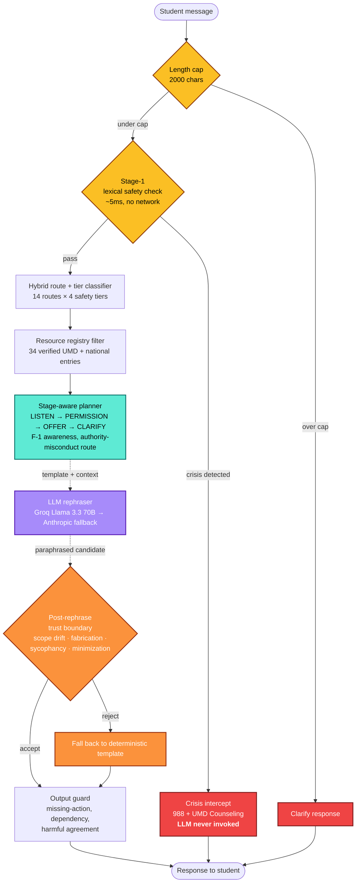

# EmpathRAG

<div align="center">

**Guarded conversational RAG support navigator for UMD students.**

[](https://python.org)
[](LICENSE)
[](https://umd.edu)
[]()
[]()

</div>

---

> Same underlying Llama 3.3 70B model, 28-scenario multi-turn safety benchmark:
> | System | Missed escalation rate |
> |---|---:|
> | **EmpathRAG Core (full stack)** | **0 / 28 — 0.0%** |
> | Same model, no pipeline | 9 / 28 — 32.1% |
>
> 95% CIs non-overlapping. The entire delta is architectural.

EmpathRAG listens to a student's message, decides what kind of support is actually needed, retrieves grounded UMD resources, and produces one practical next step. Crisis content is intercepted before any language model is invoked. It is **not** therapy, diagnosis, counseling, or an emergency service — it's a research prototype that wraps the LLM in a layered safety architecture so an off-the-shelf chatbot becomes a defensible student-support navigator.

Most chatbots route every message through the language model. This one doesn't. A deterministic safety planner decides *what* to say; the LLM only paraphrases *how*.

---

## Architecture



The deterministic planner is the trust boundary. The LLM only paraphrases. A post-rephrase verifier catches scope drift, fabricated resources, and sycophancy capitulation before they reach the student. Crisis content bypasses the LLM entirely — Stage-1 lexical precheck runs in ~5 ms and renders a deterministic crisis template directly.

---

## Headline evaluation

All numbers reproducible from this repo with a Groq API key. See [`docs/research/REPRODUCIBILITY.md`](docs/research/REPRODUCIBILITY.md) for exact commands.

### Safety floor — multi-turn benchmark

| Eval | Cells | Result |
|---|---:|---:|
| **Eval B missed escalation (full stack, rephraser ON)** | 28 | **0 / 28 (0.0%)** |
| **Eval B missed escalation (same model, unguarded baseline)** | 28 | **9 / 28 (32.1%)** |
| Eval B unsafe generation | 74 turns | 0 |
| Eval B ungrounded action | 74 turns | 0 |

### Per-layer ablation — what each layer actually catches

| Layer disabled | Missed escalation | Δ vs full stack |
|---|---:|---:|
| (none — full stack) | 0 / 28 | — |
| Stage-1 lexical precheck | **22 / 28** | **+22** |
| Output guard | 0 / 28 | — |
| Post-rephrase trust boundary | 0 / 28 | — |
| Resource registry filter | 0 / 28 | — |

Stage-1 is load-bearing for missed-escalation. The other three layers protect orthogonal failure modes (drift, sycophancy, fabrication, action-language degradation) that are caught by the targeted sweeps below — together they hit the 0/28 floor; alone each leaves gaps.

### Targeted failure-mode sweeps

| Sweep | Cells | Clean |
|---|---:|---:|
| Drift sweep (14 routes × 3 stages) | 29 | 27-29 |
| F-1 stage × ISSS contract | 12 | **12** |
| Sycophancy probes (single + multi-turn pressure) | 25 | **25** |
| Prompt-injection probes (9 attack categories) | 16 | **16** |
| Fairness spot-check (demographic perturbation) | 18 | **18** |
| Resource URL audit | 63 | 60 live |
| Regression tests | 21 | **21** |

### Statistical rigor

95% confidence intervals reported per metric. Sample-size caveats called out explicitly. Honest claims:

- The architectural improvement vs unguarded baseline is statistically meaningful at n=28 (non-overlapping CIs).
- The absolute claim "0% missed escalation in deployment" is **not** warranted by n=28 alone — we say so.
- All evaluations are on synthetic data; real student phrasing requires further data (in flight from co-author).

Full detail: [`docs/research/PAPER_FRAMING.md`](docs/research/PAPER_FRAMING.md).

---

## How V4 differs from V1

| Concern | V1 (emotion-aware open RAG) | V4 (guarded conversational RAG) |
|---|---|---|
| Generation | Mistral 7B authors response | Deterministic planner authors; LLM only paraphrases |
| Routing | 5 emotion labels | 14 routes × 4 safety tiers (hybrid rule + ML) |
| Retrieval | Generic Reddit corpus (1.67M vectors) | Curated UMD + national service registry (34 entries) |
| Crisis | NLI flags, generation continues | Stage-1 precheck intercepts; LLM never invoked |
| Bait-and-switch (V1 failure: 40% recall) | NLI fooled by positive openers | Lexical precheck + trajectory tracker + 4-mode ladder |
| Multi-turn dynamics | None | Session-aware: tier history, F-1 decay, locked sessions |
| Conversation arc | One-shot reply | LISTEN → PERMISSION → OFFER → CLARIFY |
| F-1 students | Not addressed | First-class cross-cutting concern with ISSS routing |
| Authority misconduct | Routed as academic_setback | Dedicated route → OCRSM / Student Conduct / Dean of Students |
| Sycophancy under pressure | No defense | System prompt + runtime check rejects bare-agreement framings |
| Eval methodology | Single-turn BERTScore + Wilcoxon | + Multi-turn safety eval + per-layer ablation + unguarded same-model baseline + 5 targeted sweeps |

V1 was a useful research baseline. V1 evaluation surfaced the failure modes (bait-and-switch, domain transfer, sycophancy) that motivated the V4 redesign. V1's metrics are preserved in the paper as baseline rigor; V1's bait-and-switch finding is preserved as the documented failure that drove the architecture change.

---

## Quickstart

```powershell
# 1. Clone + venv
git clone https://github.com/MukulRay1603/Empath-RAG.git
cd Empath-RAG
python -m venv venv
.\venv\Scripts\activate     # Windows
# source venv/bin/activate    # Linux/macOS

# 2. Dependencies
pip install -r requirements.txt

# 3. .env at repo root
#    GROQ_API_KEY=gsk_...
#    ANTHROPIC_API_KEY=sk-ant-...   # optional fallback

# 4. Launch the Gradio demo
$env:EMPATHRAG_DEMO_BACKEND='fast'
$env:EMPATHRAG_REPHRASER_ENABLED='1'
.\venv\Scripts\python.exe -u demo\app.py

# 5. Open http://127.0.0.1:7860/
```

Without API keys the system runs in deterministic-template mode — all safety layers still function; only the natural-language paraphrasing is offline. Crisis intercept, route classification, resource grounding, and output guard work identically.

---

## Repo

```
src/pipeline/      core.py · rephraser.py · response_planner.py
                   safety_policy.py · output_guard.py · ml_router.py
                   service_graph.py · llm_safety.py
                   support_plan.py · voice.py · v2_schema.py
demo/              app.py             Gradio UI with safety-pipeline viz
eval/              run_multiturn_eval.py · run_ablation_eval.py
                   run_unguarded_baseline.py · sweep_*.py (5 sweeps)
                   audit_resource_urls.py
data/curated/      service_graph.jsonl  (34 verified entries)
tests/             test_v25_support_navigator.py  (21 tests)
docs/              architecture/ · research/
```

Intentionally untracked: `data/curated/indexes/`, `models/router/`, `Data_Karthik/`, `.env`, generated eval reports.

---

## Documentation

| Doc | What's in it |
|---|---|
| [`docs/architecture/EMPATHRAG_CORE_ARCHITECTURE.md`](docs/architecture/EMPATHRAG_CORE_ARCHITECTURE.md) | Runtime design, 7-layer pipeline order |
| [`docs/research/PAPER_FRAMING.md`](docs/research/PAPER_FRAMING.md) | Full research framing, V1 baseline, V4 evaluation results, V1→V4 evolution |
| [`docs/research/REPRODUCIBILITY.md`](docs/research/REPRODUCIBILITY.md) | Exact reproduction commands + expected results per evaluation |
| [`docs/research/ERROR_ANALYSIS.md`](docs/research/ERROR_ANALYSIS.md) | 7 categories of observed failure modes with mitigations + residual risk |
| [`docs/research/PRIVACY_AND_DATA_FLOW.md`](docs/research/PRIVACY_AND_DATA_FLOW.md) | Student/clinician-readable: what data goes where, retention, deletion |
| [`docs/research/HIPAA_FERPA_GAP_ANALYSIS.md`](docs/research/HIPAA_FERPA_GAP_ANALYSIS.md) | Explicit accounting of compliance gaps for any future deployment |

---

## What this system is — and what it's not

**What it does:**
- Listens first; reflects what the student said back, in their own words.
- Surfaces specific UMD resources only when the conversation calls for them.
- Routes to verified UMD/national resources with provenance: source URL, last verified date, source authority.
- For F-1 students, separates emotional support from immigration questions and routes the latter to ISSS.
- For crisis prompts, intercepts before generation and redirects to 988 / UMD Counseling Center.

**What it explicitly does not do:**
- Diagnose anxiety, depression, PTSD, or any condition.
- Prescribe medication or treatment.
- Provide clinical judgment.
- Promise unconditional availability.
- Store conversations server-side beyond what the student explicitly downloads.

---

## Work in progress

Active development:

- **Real-data evaluation.** Co-author Karthik is delivering V3 data: authority-misconduct scenarios, sycophancy probes, topic-shift scenarios, real anonymized student turns. When that lands we re-run all evaluations and update headline numbers with the larger sample.
- **RoBERTa route classifier.** Phase 2 backlog. Current hybrid rule + TF-IDF + logistic accuracy is 0.86 on the test split; RoBERTa fine-tuning on V3 data will lift this.
- **Cultural cross-cutting concerns.** F-1 is the only first-class cross-cutting concern today. Queer, undocumented, parenting, Black, first-gen students each warrant the same layered treatment.
- **Multilingual reflection layer.** Hindi / Mandarin / Spanish / Korean openers for F-1 students whose first language isn't English.
- **CAPS clinician walkthrough.** Highest-leverage post-demo step; converts prototype framing into expert-reviewed prototype.
- **Counselor-pilot frontend.** A custom FastAPI + HTML/JS frontend (~3-5 focused days) for a possible UMD Counseling Center pilot. Gradio is right for paper screenshots; wrong for deployment.

---

## Known limitations

We document failure modes honestly. Full detail in [`docs/research/ERROR_ANALYSIS.md`](docs/research/ERROR_ANALYSIS.md):

- **V1 NLI bait-and-switch (40% recall).** Positive openers followed by crisis content fool the NLI guardrail. V4 mitigates with Stage-1 lexical precheck running before NLI, but the underlying NLI weakness is real and is the reason we no longer rely on it alone.
- **Synthetic-data ceiling.** All evaluations on Karthik's curated synthetic dataset. Real student phrasing (code-switching, slang, emoji) is structurally different. Numbers here are prototype evidence, not deployment claims.
- **Statistical power.** n = 28 escalation scenarios. CIs are wide. Some absolute claims need a larger sample to survive review.
- **Route classifier ceiling at 0.86.** Remaining 14% land in `general_student_support` (graceful degradation, no fabrication, just less specific resource matching).
- **HIPAA / FERPA non-compliant.** Groq doesn't sign BAAs for commercial chat. The architecture is HIPAA-compatible in design; the deployment isn't. Explicit gap analysis in [`docs/research/HIPAA_FERPA_GAP_ANALYSIS.md`](docs/research/HIPAA_FERPA_GAP_ANALYSIS.md).
- **Cultural cross-cutting underbuilt.** Only F-1 students get first-class layered treatment.
- **No real student pilot yet.** All evaluation is synthetic.

---

## Contributors

- **Mukul Rayana** — UMD MSML, project lead. Architecture, code, evaluation design, V1 through V4 development.
- **Karthik** — UMD MSML, dataset and curated-corpus delivery.

Class project for MSML641 (Applied Machine Learning), University of Maryland. Built openly for academic use. Not a UMD product or service.

## License

[MIT](LICENSE). Dataset and third-party model licenses vary; full provenance in [`docs/research/PAPER_FRAMING.md`](docs/research/PAPER_FRAMING.md).
