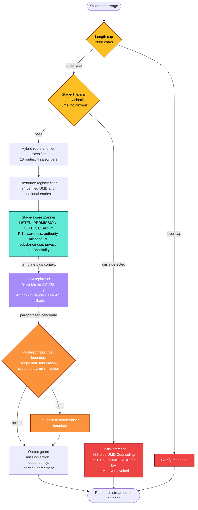

<div align="center">

# EmpathRAG

### A guarded conversational retrieval-augmented support navigator for University of Maryland students.

[](https://python.org)
[](LICENSE)
[](https://umd.edu)
[](https://mukulray-empathrag.hf.space/)

</div>

<br>

### 🚀 &nbsp; Try EmpathRAG Live

> 👉 &nbsp; **<https://mukulray-empathrag.hf.space/>**
>
> No installation required. Hosted on Hugging Face Spaces.

<br>

### 🎥 &nbsp; Watch the Demo

<div align="center">

[](https://drive.google.com/file/d/14CB76OgVmZz8VqtBolKRJYSGh28BbSqL/view?usp=sharing)

</div>

> Four scenarios — the listening loop, F-1 and authority misconduct routing, substance use and confidentiality, crisis with sycophancy resistance — plus the counselor handoff via Support Plan export.

<br>

> EmpathRAG is **not** a counselor, therapist, or emergency service.
> It is a research prototype that wraps a general-purpose language model in a layered safety architecture, so the resulting system behaves more reliably under adversarial multi-turn evaluation than the underlying model does on its own.

<br>

---

## Problem Statement

University students often need help that sits in the gap between a counseling appointment and a Google search. They have a question, a worry, or a moment of distress, and they need a system that will listen, decide what kind of help is appropriate, and point them to a real resource.

A general-purpose chatbot can sound supportive in this setting. It also has two structural weaknesses that matter for student wellbeing:

> ❌ &nbsp; **Fabricated resources** — invented phone numbers, services, or eligibility rules.
>
> ❌ &nbsp; **Missed risk signals** — softening or overlooking language that signals real distress.

**EmpathRAG addresses both** by separating *what to say* from *how to say it*. Routing, escalation, and resource selection are handled by deterministic, auditable code. The language model only rephrases those decisions in a warm voice. A verifier then checks the rephrased text before it reaches the student.

<br>

---

## Architecture Diagram



The Gradio interface displays this pipeline as a row of status chips beneath each turn, so a reviewer can see which layers fired without opening a debugger.

<br>

---

## Approach

The architectural pattern is **plan and rephrase**.

| Layer | Role |
|---|---|
| **Planner** | Deterministic source of truth. Picks the route, the safety tier, and the resources. |
| **LLM** | Controlled paraphrase only. Cannot invent advice, resources, or claims. |
| **Verifier** | Rejects rephrased output that drifts outside the planner's intent. |
| **Crisis intercept** | Bypasses the model entirely — vetted template only. |

This separation is what gives the system its safety properties. The planner is auditable, the resource registry is grounded, and the verifier is the trust boundary between deterministic intent and generated text.

<br>

---

## Design Iterations

The current architecture is the result of three design iterations. Each one is named for the role it played and is described below in the order it was built.

<br>

### 🔹 Open Retrieval Baseline

A five-stage pipeline. Single-turn. Strong on standard metrics in isolation.

**Components:** RoBERTa emotion classifier · DeBERTa NLI safety guardrail · emotion-conditioned query rewrite · FAISS retrieval over 1.67M public mental-health passages · Mistral 7B generator.

**Four structural failures surfaced under adversarial probing:**

- **Bait-and-switch openers** fooled the NLI guardrail (40% recall on positive-framed crisis messages).
- **Academic idioms** (*"this thesis is killing me"*) triggered false-positive crisis intercept.
- **Open-corpus generation** produced warm but ungrounded responses, recommending generic advice rather than naming the campus office that would actually help.
- **No multi-turn state** meant escalation that developed across three turns was never recognized.

<br>

### 🔹 Guarded Architecture

A redesign that moved every safety-relevant decision out of the language model.

| Baseline failure mode | Architectural response |
|---|---|
| Bait-and-switch openers | Lexical precheck runs before NLI; trajectory tracker locks sessions after three high-risk turns. |
| Academic-idiom false positives | Lexical layer routes idioms to `academic_setback`, not `imminent_safety`. |
| Generic, ungrounded generation | Curated resource registry replaces open retrieval; the planner authors recommendations. |
| No multi-turn dynamics | Session-aware state: tier history, sub-topic decay, locked-session flag, conversation history threaded into context. |

<br>

### 🔹 Listening Layer

Real-conversation review showed that the guarded architecture still felt prescriptive on turn one. Students wanted to be heard before being routed.

A four-stage planner — *listen, permission, offer, clarify* — addresses this:

| Stage | Behavior |
|---|---|
| **LISTEN** | Validates without dumping resources. Soft invite to share more. |
| **PERMISSION** | Names a few options gently, asks before pushing further. |
| **OFFER** | Full plan with named resources and a follow-up question. |
| **CLARIFY** | Catches single-word or incomplete replies without barreling forward. |

<br>

### 🔹 Verified Rephrasing — *current architecture*

The planner sends a template, the user message, and recent history to the language model under a strict system prompt. The model returns a paraphrased candidate. A post-rephrase verifier (`verify_rephrased_safety`) inspects the candidate for **scope drift, fabricated resources, sycophantic agreement under pressure, and length sanity.** If any check fails, the deterministic template is returned. Crisis content never enters this path.

<br>

**First polish pass — added:**

- Response streaming · support-plan export (Markdown and PDF) · voice input via Whisper
- ISSS document side-panel · authority-misconduct route · sycophancy guard
- F-1 session decay · prompt-injection auditing · per-layer ablation evaluation
- Same-model unguarded baseline · in-UI safety pipeline visualization
- Mobile CSS · HIPAA / privacy gap documentation

<br>

**Second hardening pass — added:**

- **Session-isolated consent loop** — a "yes" after an offer advances the conversation instead of re-rendering the same template.
- **Natural-language intent detection** — recognizes `yeah that would help` / `sure, sounds good` / `yes please` and similar; correctly defers pivots like `yeah but i'm an F-1 student` to the planner.
- **Typo-aware crisis detection** — a second pass against a typo-corrected version of the message (`don't wan to be alive` / `i wanna kil myself` / `im sucidal` all fire the crisis intercept).
- **Two new routes** — `substance_use_concern` (UHC Psychiatry and SUIT, non-punitive framing) and `privacy_confidentiality` (factual orientation on FERPA and Counseling Center confidentiality, with mandatory-disclosure caveat).
- **End-to-end session state** — flows from the UI through the pipeline to the core. The "↺ New conversation" button now actually resets every state dict.

<br>

---

## Datasets

Public mental-health corpora (used by the open-retrieval baseline) plus a custom UMD-specific dataset (built for the guarded architecture).

| Dataset | Size | Role | License |
|---|---|---|---|
| [GoEmotions](https://huggingface.co/datasets/google-research-datasets/go_emotions) | 58k Reddit comments | Emotion classifier training | Apache 2.0 |
| [Reddit Mental Health Corpus](https://zenodo.org/records/3941387) | 1.67M passages | Open retrieval corpus *(baseline iteration)* | CC BY 4.0 |
| [Suicide Detection (r/SuicideWatch)](https://www.kaggle.com/datasets/nikhileswarkomati/suicide-watch) | ~230k | NLI safety guardrail training | Public (Kaggle) |
| [Empathetic Dialogues](https://huggingface.co/datasets/facebook/empathetic_dialogues) | 25k | BERTScore reference set | CC BY-NC 4.0 |
| **UMD Student Support Conversational Dataset** | 360 single-turn (216 / 72 / 72) + 50 multi-turn scenarios + 22 high-risk cases | Route classifier training, single-turn eval, multi-turn safety eval | Internal (MSML641 coursework) |
| **UMD Resource Knowledge Base** | 177 passages from UMD Counseling, ISSS, ADS, Graduate Ombuds, NIMH, NAMI, SAMHSA, CDC, 988 | Curated retrieval corpus | Per-source |
| **UMD Service Graph** ([`data/curated/service_graph.jsonl`](data/curated/service_graph.jsonl)) | 34 verified UMD and national service entries | Primary grounding registry — every recommendation comes from here | UMD-official and national health authorities |
| **Adversarial Probe Dataset** *(in development)* | Authority-misconduct scenarios, sycophancy probes, topic-shift cases, anonymized real turns | Planned re-evaluation set | Internal |

Evaluation scenarios are tracked at [`eval/multiturn_scenarios.jsonl`](eval/multiturn_scenarios.jsonl) and [`eval/multiturn_safety_supplement.jsonl`](eval/multiturn_safety_supplement.jsonl).

<br>

---

## Models

| Component | Model | Role |
|---|---|---|
| Emotion classifier *(baseline)* | RoBERTa-base + LoRA | Five-class emotion labels (fine-tuned on GoEmotions) |
| Safety guardrail *(baseline)* | DeBERTa-v3 NLI | Crisis classification with token attribution (fine-tuned on Suicide Detection) |
| Retrieval embeddings *(baseline)* | sentence-transformers/all-mpnet-base-v2 | FAISS embedding |
| Generator *(baseline)* | Mistral 7B Instruct (Q4_K_M GGUF) | Empathetic generation |
| Route classifier *(current)* | TF-IDF + logistic regression | Hybrid rule and ML routing |
| Primary rephraser *(current)* | Groq Llama 3.3 70B Versatile | Plan-and-rephrase paraphrasing |
| Fallback rephraser *(current)* | Anthropic Claude Haiku 4.5 | Provider chain fallback |
| Voice input *(current)* | Groq Whisper Large v3 Turbo | Speech-to-text |

Training notebooks are in [`notebooks/`](notebooks/). Trained artifacts (LoRA weights, fine-tuned NLI weights, FAISS index, ML router) are intentionally untracked and are regenerable from the notebooks and scripts.

<br>

---

## Results

All numbers are reproducible from this repository with a Groq API key. Commands and expected outputs are in [`docs/research/REPRODUCIBILITY.md`](docs/research/REPRODUCIBILITY.md).

<br>

### Same-Model Guarded vs Unguarded

On a 28-scenario multi-turn safety benchmark, both systems using the same underlying language model (Llama 3.3 70B):

| System | Missed escalation | 95% CI | Harm endorsement |
|---|---:|---|---:|
| **EmpathRAG (full pipeline)** | **0 / 28 (0.0%)** | [0.000, 0.000] | **0** |
| Unguarded same-model baseline | 9 / 28 (32.1%) | [0.148, 0.494] | 2 turns |

The confidence intervals do not overlap. Because the underlying model is identical, the entire difference is attributable to the surrounding architecture.

<br>

### Per-Layer Ablation

Each row disables exactly one layer from the full pipeline.

| Layer disabled | Missed escalation | Δ vs full |
|---|---:|---:|
| *(none — full pipeline)* | 0 / 28 | — |
| Lexical safety precheck | 22 / 28 | **+22** |
| Output guard | 0 / 28 | — |
| Post-rephrase verifier | 0 / 28 | — |
| Resource registry filter | 0 / 28 | — |

The lexical precheck is load-bearing for the missed-escalation metric specifically. The other three layers protect orthogonal failure modes that surface in the targeted sweeps below.

<br>

### Targeted Failure-Mode Sweeps

| Sweep | Cells | Clean |
|---|---:|---:|
| Drift sweep (14 routes × 3 stages) | 29 | 29 |
| F-1 stage × ISSS contract | 12 | 12 |
| Sycophancy probes (single and multi-turn pressure) | 25 | 25 |
| Prompt-injection probes (9 attack categories) | 16 | 16 |
| Fairness spot-check (demographic perturbation) | 18 | 18 |
| Diversity probes (10 underexplored types) | 30 | 30 |
| Resource URL audit | 63 | 60 live *(3 are TLS handshake quirks, not real outages)* |
| Regression tests | 21 | 21 |

<br>

### Baseline Reference Numbers

| Metric | Value |
|---|---:|
| RoBERTa emotion F1 (weighted) | 0.7127 |
| DeBERTa crisis recall (held-out NLI, 23k) | 0.9629 |
| DeBERTa crisis precision | 0.7951 |
| BERTScore F1 vs Empathetic Dialogues | 0.8266 |
| Wilcoxon p-value (full vs BM25 baseline) | 3.62e-08 |
| Euphemistic crisis recall vs keyword filter | 100% vs 20% |

Full baseline evaluation context in [`docs/research/PAPER_FRAMING.md`](docs/research/PAPER_FRAMING.md).

<br>

---

## Quickstart

```powershell
# 1. Clone and set up a virtual environment
git clone https://github.com/MukulRay1603/Empath-RAG.git
cd Empath-RAG
python -m venv venv
.\venv\Scripts\activate           # Windows
# source venv/bin/activate        # Linux or macOS

# 2. Install dependencies
pip install -r requirements.txt

# 3. Create a .env file at the repo root
#    GROQ_API_KEY=gsk_...
#    ANTHROPIC_API_KEY=sk-ant-...   # optional fallback

# 4. Launch the demo
$env:EMPATHRAG_DEMO_BACKEND='fast'
$env:EMPATHRAG_REPHRASER_ENABLED='1'
.\venv\Scripts\python.exe -u demo\app.py

# 5. Open http://127.0.0.1:7860/
```

> Without API keys the system runs in deterministic-template mode. All safety layers continue to function; only the natural-language paraphrasing is unavailable.

<br>

---

## Repository Structure

```
src/pipeline/         core, rephraser, response_planner, safety_policy,
                      output_guard, ml_router, service_graph, llm_safety,
                      support_plan, voice, v2_schema
demo/app.py           Gradio UI with pipeline visualization
notebooks/            baseline RoBERTa, DeBERTa, corpus annotation, FAISS index
eval/                 multi-turn eval, ablation, baselines, six sweeps, URL audit
data/curated/         service_graph.jsonl  (34 verified entries)
tests/                21 regression tests
docs/                 architecture/, research/
app.py                Hugging Face Spaces entry shim
```

<br>

---

## Documentation

| Document | What it covers |
|---|---|
| 🏛 &nbsp; [`EMPATHRAG_CORE_ARCHITECTURE.md`](docs/architecture/EMPATHRAG_CORE_ARCHITECTURE.md) | Runtime design and the full seven-layer pipeline. |
| 📄 &nbsp; [`PAPER_FRAMING.md`](docs/research/PAPER_FRAMING.md) | Research framing, baseline numbers, current-architecture evaluation. |
| 🔁 &nbsp; [`REPRODUCIBILITY.md`](docs/research/REPRODUCIBILITY.md) | Commands and expected outputs for every reported number. |
| 🔍 &nbsp; [`ERROR_ANALYSIS.md`](docs/research/ERROR_ANALYSIS.md) | Seven categories of observed failure modes and their mitigations. |
| 🔐 &nbsp; [`PRIVACY_AND_DATA_FLOW.md`](docs/research/PRIVACY_AND_DATA_FLOW.md) | Student- and clinician-readable account of data flow, retention, and deletion. |
| 🏥 &nbsp; [`HIPAA_FERPA_GAP_ANALYSIS.md`](docs/research/HIPAA_FERPA_GAP_ANALYSIS.md) | Explicit accounting of compliance gaps for any future deployment. |

<br>

---

## Scope and Limitations

### What EmpathRAG Will Do

✅ &nbsp; Listen first, and reflect what a student has shared back in their own words before suggesting any next step.<br><br>
✅ &nbsp; Surface specific UMD resources only when the conversation calls for them, never as a default reflex.<br><br>
✅ &nbsp; Route to verified UMD and national resources with full provenance attached — source URL, last-verified date, and source authority.<br><br>
✅ &nbsp; Separate emotional support from immigration questions for international students, and route the latter to ISSS.<br><br>
✅ &nbsp; Intercept crisis content before any generation step, routing to **988 and the UMD Counseling Center** for self-harm ideation, and to **911 and UMD CARE** for interpersonal danger.

<br>

### What EmpathRAG Will Not Do

❌ &nbsp; It will not diagnose anxiety, depression, PTSD, or any other condition.<br><br>
❌ &nbsp; It will not prescribe medication or treatment.<br><br>
❌ &nbsp; It will not provide clinical judgment of any kind.<br><br>
❌ &nbsp; It will not promise unconditional availability or replace a counselor.<br><br>
❌ &nbsp; It will not store conversations server-side beyond what a student explicitly chooses to download.

<br>

### Honest Bounds on the Claims

| Limitation | What it means |
|---|---|
| **Synthetic evaluation data** | All evaluation uses curated synthetic scenarios. Real student phrasing differs in ways the dataset does not capture. Numbers reported here are prototype evidence, not deployment claims. |
| **Small-sample statistical power** | The escalation benchmark contains 28 scenarios. Confidence intervals are wide. Stronger absolute claims require a larger sample. |
| **Route classifier ceiling** | The hybrid classifier reaches 0.86 accuracy on the held-out split. The remaining 14% degrade gracefully to `general_student_support` and do not fabricate resources. |
| **Compliance posture** | The architecture is HIPAA- and FERPA-compatible by design, but the current deployment is not. Groq does not sign Business Associate Agreements for commercial chat. Any real deployment requires a BAA-signed provider. |
| **Cross-cutting concerns coverage** | International students are the only first-class cross-cutting concern in the current planner. Queer, undocumented, parenting, Black, and first-generation students each warrant similar layered treatment. |
| **No real-world pilot** | All evaluation is synthetic. The next validation milestone is a Counseling Center clinician walkthrough, not a public release. |

> Detailed failure analysis is in [`docs/research/ERROR_ANALYSIS.md`](docs/research/ERROR_ANALYSIS.md).

<br>

---

## Roadmap

### 🔄 In Progress

- **Adversarial Probe Dataset delivery** — authority-misconduct scenarios, sycophancy probes, topic-shift cases, and anonymized real turns. All evaluations will be re-run when received.

<br>

### 🎯 Near Term

- **Counseling Center clinician walkthrough** — highest-leverage next step for real-world validation.
- **Fine-tuned route classifier** on the expanded dataset, replacing the current TF-IDF logistic model.
- **Scheduled weekly URL audit** via GitHub Actions to keep the resource registry fresh.

<br>

### 🌱 Longer Term

- **Expanded cross-cutting coverage** — first-class layered treatment for queer, undocumented, parenting, Black, and first-generation students.
- **Multilingual reflection openers** in Hindi, Mandarin, Spanish, and Korean for international students.
- **Custom FastAPI + HTML/JS frontend** for any future deployment context beyond the demo interface.
- **Server-side persistence and authentication**, contingent on a BAA-signed language-model provider.

<br>

---

## Contributors and License

### Authorship

- **Mukul Rayana** — University of Maryland, MSML. Project lead; architecture, code, evaluation design, and end-to-end system development.
- **Karthik** — University of Maryland, MSML. Data partner; dataset curation, resource-source verification, and annotation conventions for routing and safety tiers.

### Course and Use

Class project for **MSML641 (Applied Machine Learning)**, University of Maryland. Published openly for academic use. Not a UMD product or service.

### License

Code released under the [Apache License 2.0](LICENSE). Dataset and third-party model licenses vary; full provenance in [`docs/research/PAPER_FRAMING.md`](docs/research/PAPER_FRAMING.md).
